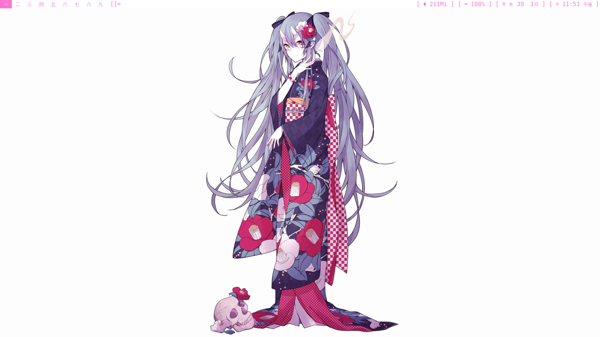

   ▴ **OS** -> [ARCH](https://archlinux.org/)
   
   ▴ **WM** -> [DWM](https://dwm.suckless.org/)
   
   ▴ **Terminal** -> [ST](https://st.suckless.org/)
   
   ▴ **Application Launcher** -> [DMENU](https://github.com/davatorium/rofi)
