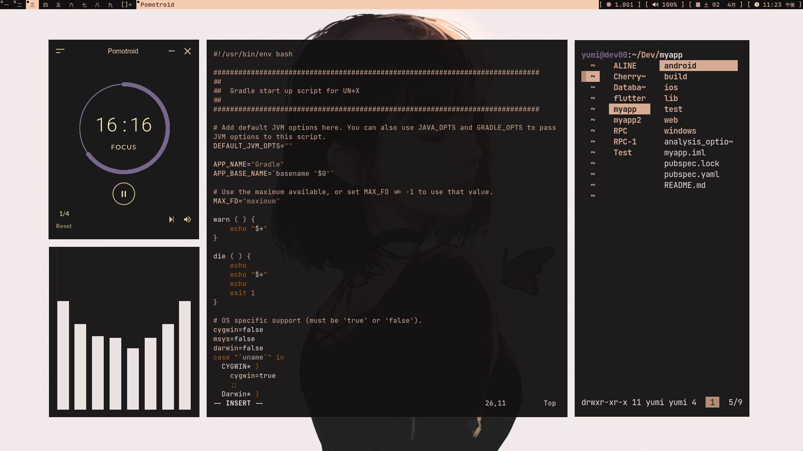

   
   ▴ **OS** ==> [ARCH](https://archlinux.org/)
   
    
   
   ▴ **WM** ==> [DWM](https://dwm.suckless.org/)
   
    
   
   ▴ **Terminal** ==> [ST](https://st.suckless.org/)
   
    
   
   ▴ **Application Launcher** ==> [DMENU](https://github.com/davatorium/rofi)
   
    
   

    

   ▴ **Timer** ==> [Pomotroid](https://splode.github.io/pomotroid/)
   
    
   
   ▴ **Text-editor** ==> [neovim](https://neovim.io/)
   
    
   
   ▴ **Audio-Visualizer** ==> [Cava](https://github.com/karlstav/cava/)
   
    
   
   ▴ **File-Manager** ==> [lf](https://github.com/gokcehan/lf/)
   
